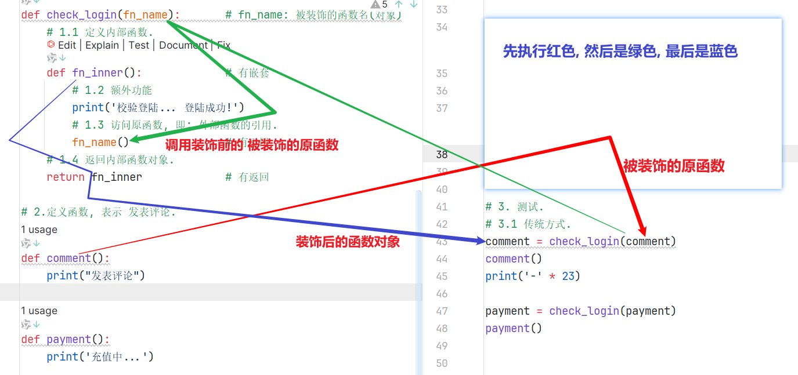

# 第4章 闭包、装饰器与深浅拷贝

> 黑马程序员大模型Python语言进阶 · 第三章

---

## 一、闭包（Closure）

### 1.1 为什么需要闭包？

普通函数调用结束后，函数内部的局部变量就会被销毁。如果想在**多次调用之间保持某个变量的状态**，闭包就派上用场了。

```python
# 普通写法：每次调用都重新初始化
def func():
    num = 10
    return num

num = func()
print(num + 1)  # 11
print(num + 1)  # 11 — 无法累加，因为 num 每次都是 10
```

### 1.2 闭包是什么

**定义**：内部函数使用了外部函数的变量，这种写法就叫闭包。闭包可以让外部函数的变量"活"在内部函数的作用域里，不会被销毁。    

### 1.3 闭包三要素

| 要素 | 说明 |
|------|------|
| **有嵌套** | 外部函数嵌套内部函数 |
| **有引用** | 内部函数使用外部函数的变量 |
| **有返回** | 外部函数返回内部函数名（对象） |

```python
# 闭包标准格式
def 外部函数(外部参数):
    外部局部变量

    def 内部函数(内部参数):
        使用外部函数的变量    # 有引用

    return 内部函数           # 有返回
```

### 1.4 闭包入门示例


```python
# 函数名 vs 函数名()：前者是对象，后者是调用
def get_sum(a, b):
    return a + b

print(get_sum)       # <function get_sum at 0x...>  → 函数对象
print(get_sum(10, 20))   # 30                        → 调用结果

# 函数名可以赋值给变量
my_sum = get_sum
print(my_sum(100, 200))   # 300
```

```python
# 闭包实例：求和闭包
def fn_outer(num1):            # 外部函数
    def fn_inner(num2):        # 内部函数 —— 有嵌套
        sum = num1 + num2      # 使用外部变量 —— 有引用
        print(f'求和结果: {sum}')
    return fn_inner             # 返回内部函数 —— 有返回


fn_inner = fn_outer(10)
fn_inner(20)     # 求和结果: 30

# 链式调用写法
fn_outer(100)(200)  # 求和结果: 300
```

> **关键理解**：`fn_outer(10)` 返回的不是数值，而是一个**绑定了 `num1=10` 的函数对象**。之后每次调用这个函数时，`num1` 的值都还在。

### 1.5 nonlocal 关键字

默认情况下，内部函数只能**读取**外部函数的变量，不能修改它。要用 `nonlocal` 声明才能修改。


```python
def fn_outer():
    a = 100

    def fn_inner():
        nonlocal a      # 声明：a 来自外部函数，我要修改它
        a = a + 1
        print(f'a: {a}')

    return fn_inner


f = fn_outer()
f()   # a: 101
f()   # a: 102  ← a 的值被保留了！
f()   # a: 103
```

> **对比记忆**：
> - `global` → 声明使用全局变量
> - `nonlocal` → 声明使用外部函数的变量

---

## 二、装饰器（Decorator）

### 2.1 装饰器是什么

装饰器的本质是一个**闭包函数**，作用是**在不改变原函数代码的基础上，给原函数增加额外功能**。

大白话类比：**装修队不拆房屋结构，只做美化增强**。

### 2.2 装饰器四要素（比闭包多一个）

| 要素 | 说明 |
|------|------|
| 有嵌套 | 外部函数嵌套内部函数 |
| 有引用 | 内部函数调用外部函数传入的原函数 |
| 有返回 | 外部函数返回内部函数对象 |
| **有额外功能** | 在调用原函数前后添加逻辑 |

### 2.3 装饰器两种用法



#### 写法一：传统方式

```python
# 1. 定义装饰器（本质是闭包）
def check_login(fn_name):          # 接收被装饰的函数对象
    def fn_inner():                # 有嵌套
        print('校验登陆... 登陆成功!')  # 额外功能
        fn_name()                  # 调用原函数 —— 有引用
    return fn_inner                # 有返回

# 2. 定义原函数
def comment():
    print("发表评论")

# 3. 手动装饰 + 调用
comment = check_login(comment)  # 把原函数"包装"一下
comment()                       # 先登录，再发表评论
```

#### 写法二：语法糖（推荐 ✅）

```python
@check_login    # 等价于 comment = check_login(comment)
def comment():
    print("发表评论")

comment()       # 直接调用即可
```

> 执行顺序：先执行红色（装饰器），再绿色（内部函数），最后蓝色（原函数）

### 2.4 装饰器四大场景

核心原则：**装饰器的内部函数签名必须和被装饰的原函数一致**

- 原函数无参无返回 → 内部函数也**无参无返回**
- 原函数有参无返回 → 内部函数也**有参无返回**
- 原函数无参有返回 → 内部函数也**无参有返回**
- 原函数有参有返回 → 内部函数也**有参有返回**

#### 场景1：无参无返回值的原函数


```python
def my_decorator(fn_name):
    def fn_inner():                    # 无参无返回 ← 和原函数一致
        print('正在努力计算中...')       # 额外功能
        fn_name()                      # 调用原函数
    return fn_inner


@my_decorator
def get_sum():
    a, b = 10, 20
    print(f'sum求和结果: {a + b}')

get_sum()
# 输出：
# 正在努力计算中...
# sum求和结果: 30
```

#### 场景2：有参无返回值的原函数

```python
def my_decorator(fn_name):
    def fn_inner(x, y):               # 有参无返回 ← 和原函数一致
        print('正在努力计算中...')
        fn_name(x, y)
    return fn_inner


@my_decorator
def get_sum(a, b):
    print(f'sum求和结果: {a + b}')

get_sum(10, 20)
```

#### 场景3：无参有返回值的原函数

```python
def my_decorator(fn_name):
    def inner():                      # 无参有返回 ← 和原函数一致
        print('正在计算中...')
        result = fn_name()            # 接收原函数返回值
        return result                 # 把返回值透传出去
    return inner


@my_decorator
def get_sum():
    return 10 + 20

print(get_sum())  # 30
```

#### 场景4：有参有返回值的原函数（通用写法）

```python
def my_decorator(fn_name):
    def inner(*args, **kwargs):       # 万能参数，适配任何原函数
        print('正在计算中...')
        result = fn_name(*args, **kwargs)
        return result
    return inner


@my_decorator
def get_sum(*args, **kwargs):
    total = sum(args) + sum(kwargs.values())
    return total

print(get_sum(1, 3, 4, 5, a=10, b=20))
# 正在计算中...
# 43
```

### 2.5 多个装饰器叠加

```python
def check_user(fn):
    def inner():
        print("校验用户信息...")
        fn()
    return inner

def check_code(fn):
    def inner():
        print("验证验证码...")
        fn()
    return inner


@check_user          # 第二层装饰（外层）
@check_code          # 第一层装饰（内层）
def comment():
    print("发表评论")

comment()
# 输出：
# 校验用户信息...
# 验证验证码...
# 发表评论
```

> 装饰顺序：**从下往上执行，从上往下生效**。离函数定义最近的先装饰。

### 2.6 带参数的装饰器

当装饰器本身需要接收参数时，需要**再包一层函数**：

```python
def logging(flag):              # 最外层：接收装饰器参数
    def decorator(fn):          # 中间层：接收被装饰的函数（这才是真正的装饰器）
        def inner(a, b):
            if flag == "+":
                print("--正在努力做加法运算--")
            elif flag == "-":
                print("--正在努力做减法运算--")
            result = fn(a, b)
            return result
        return inner
    return decorator            # 返回真正的装饰器


@logging('+')                   # 给装饰器传参数
def add(a, b):
    return a + b

@logging('-')
def sub(a, b):
    return a - b

print(add(3, 5))    # --正在努力做加法运算--  \n  8
print(sub(10, 4))   # --正在努力做减法运算--  \n  6
```

---

## 三、深浅拷贝（Deep & Shallow Copy）

### 3.1 可变 vs 不可变对象

| 类型 | 分类 | 特点 |
|------|------|------|
| `str`, `int`, `float`, `tuple`, `bool` | **不可变** | 修改时创建新对象，id 会变 |
| `list`, `dict`, `set` | **可变** | 修改时原地变更，id 不变 |

```python
a = "hello"
print(id(a))         # 内存地址 A
a = a + " world"
print(id(a))         # 内存地址 B（新的字符串对象）

lst = [1, 2, 3]
print(id(lst))       # 内存地址 C
lst.append(4)
print(id(lst))       # 还是 C（原地修改）
```

### 3.2 赋值 ≠ 拷贝

直接赋值只是让新变量**指向同一个内存地址**，不是复制：

```python
a = [1, 2, 3]
b = a          # b 和 a 指向同一个列表
b.append(4)
print(a)       # [1, 2, 3, 4] ← a 也变了！
print(b)       # [1, 2, 3, 4]
print(id(a) == id(b))  # True，同一个对象
```

### 3.3 浅拷贝（Shallow Copy）

创建一个新对象，但内部的**子对象仍然是引用**。

```python
import copy

a = [1, 2, [3, 4]]
b = copy.copy(a)       # 浅拷贝

print(id(a) != id(b))  # True，是新对象 ✓
print(id(a[2]) == id(b[2]))  # True，但内部子对象共享 ✗

b[2].append(5)
print(a)  # [1, 2, [3, 4, 5]] ← 内部的子列表被影响了！
```

适用场景：只有一层结构（没有嵌套的可变对象）。

### 3.4 深拷贝（Deep Copy）

递归拷贝所有层级的对象，完全独立。

```python
import copy

a = [1, 2, [3, 4]]
b = copy.deepcopy(a)    # 深拷贝

print(id(a) != id(b))        # True
print(id(a[2]) != id(b[2]))  # True，子对象也是独立的 ✓

b[2].append(5)
print(a)  # [1, 2, [3, 4]]   ← 完全不受影响 ✓
print(b)  # [1, 2, [3, 4, 5]]
```

### 3.5 总结对照表

| 操作 | 是否新建顶层对象 | 子对象是否独立 | 适用场景 |
|------|:-:|:-:|------|
| 直接赋值 `=` | ❌ 共享 | ❌ 共享 | 只是起别名 |
| 浅拷贝 `copy()` / `list()` / `[:]` | ✅ 新建 | ❌ 共享 | 无嵌套可变对象 |
| 深拷贝 `deepcopy()` | ✅ 新建 | ✅ 独立 | 有嵌套可变对象 |

---

## 四、本章知识图谱

```
Python 进阶第三章
├── 闭包 (Closure)
│   ├── 三要素：嵌套 + 引用 + 返回
│   ├── 核心价值：让外部变量在多次调用间保持状态
│   └── nonlocal 关键字：允许内部函数修改外部变量
│
├── 装饰器 (Decorator)
│   ├── 本质 = 闭包 + 额外功能
│   ├── 四要素：嵌套 + 引用 + 返回 + 额外功能
│   ├── 两种写法：传统方式 / @语法糖
│   ├── 四种场景：匹配原函数的有参/有返回情况
│   ├── 多装饰器叠加
│   └── 带参数的装饰器（三层嵌套）
│
└── 深浅拷贝
    ├── 可变 vs 不可变对象
    ├── 赋值 ≠ 拷贝
    ├── 浅拷贝：copy() / 切片 / 构造方法
    └── 深拷贝：deepcopy()
```
