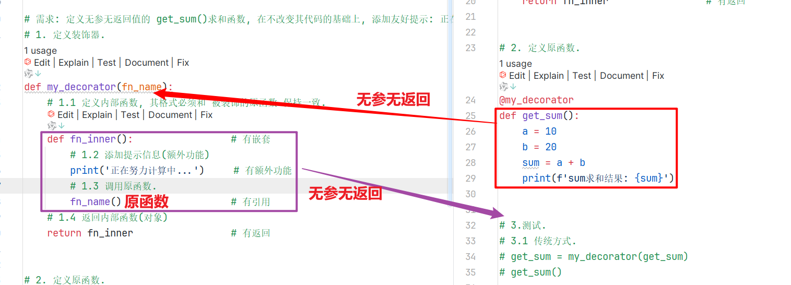

---
tags:
  - 学习笔记
source_type: 视频+PPT+随堂笔记
source_title: 黑马程序员大模型Python进阶 — Day03 闭包装饰器与深浅拷贝
source_url:
date: 2026-06-15
---

# 闭包装饰器与深浅拷贝

## 资料信息

| 字段     | 内容                                |
| ------ | --------------------------------- |
| 类型     | 视频 + PPT + 随堂笔记                   |
| 标题     | 黑马程序员大模型Python进阶 — Day03 闭包装饰器与深浅拷贝 |
| 来源/链接  | B站黑马程序员课程                         |
| 作者/UP主 | 黑马程序员                             |

## 核心要点

1. 闭包的作用、构成条件（嵌套+引用+返回）和语法；nonlocal 关键字
2. 装饰器的作用、构成条件（嵌套+引用+返回+额外功能）和两种语法写法
3. 装饰器四大场景（有参/无参 × 有返回/无返回）及通用万能参数写法
4. 深拷贝与浅拷贝的区别：浅拷贝子对象共享，深拷贝完全独立

## 详细笔记

### 一、闭包（Closure）

#### 1. 为什么需要闭包？

普通函数调用结束后，内部局部变量就被销毁。如果想在**多次调用之间保持某个变量的状态**，就需要闭包。

```python
# 普通写法：每次调用都重新初始化，无法累加
def func():
    num = 10
    return num

num = func()
print(num + 1)  # 11
print(num + 1)  # 11 — num 每次都是 10，无法保留变化
```

#### 2. 闭包是什么

内部函数使用了外部函数的变量，这种写法就叫闭包。闭包可以让外部函数的变量"活"在内部函数的作用域里，不会被销毁。

#### 3. 闭包三要素

| 要素     | 说明                   |
| ------ | -------------------- |
| **有嵌套** | 外部函数嵌套内部函数            |
| **有引用** | 内部函数使用外部函数的变量         |
| **有返回** | 外部函数返回内部函数名（对象，不是调用结果） |

```python
# 闭包标准格式
def 外部函数(外部参数):
    外部局部变量

    def 内部函数(内部参数):
        使用外部函数的变量    # 有引用

    return 内部函数           # 有返回
```

#### 4. 闭包入门示例


```python
# 函数名 vs 函数名()：前者是对象，后者是调用
def get_sum(a, b):
    return a + b

print(get_sum)           # <function get_sum at 0x...>  → 函数对象
print(get_sum(10, 20))   # 30  → 调用结果

# 函数名可以赋值给变量
my_sum = get_sum
print(my_sum(100, 200))  # 300
```

```python
# 闭包实例：求和闭包
def fn_outer(num1):            # 外部函数
    def fn_inner(num2):        # 内部函数 —— 有嵌套
        sum = num1 + num2      # 使用外部变量 —— 有引用
        print(f'求和结果: {sum}')
    return fn_inner             # 返回内部函数 —— 有返回


fn_inner = fn_outer(10)
fn_inner(20)     # 求和结果: 30

# 链式调用写法
fn_outer(100)(200)  # 求和结果: 300
```

> **关键理解**：`fn_outer(10)` 返回的不是数值，而是一个**绑定了 `num1=10` 的函数对象**。之后每次调用这个函数时，`num1` 的值都还在。

#### 5. nonlocal 关键字

默认情况下，内部函数只能**读取**外部函数的变量，不能修改它。要用 `nonlocal` 声明才能修改。


```python
def fn_outer():
    a = 100

    def fn_inner():
        nonlocal a      # 声明：a 来自外部函数，我要修改它
        a = a + 1
        print(f'a: {a}')

    return fn_inner


f = fn_outer()
f()   # a: 101
f()   # a: 102  ← a 的值被保留了！
f()   # a: 103
```

> **对比记忆**：`global` → 声明使用全局变量；`nonlocal` → 声明使用外部函数的变量

---

### 二、装饰器（Decorator）

#### 1. 装饰器是什么

装饰器的本质是一个**闭包函数**，作用是**在不改变原函数代码的基础上，给原函数增加额外功能**。

大白话类比：**装修队不拆房屋结构，只做美化增强**。

#### 2. 装饰器四要素（比闭包多一个"额外功能"）

| 要素       | 说明                    |
| -------- | --------------------- |
| 有嵌套      | 外部函数嵌套内部函数             |
| 有引用      | 内部函数调用外部函数传入的原函数       |
| 有返回      | 外部函数返回内部函数对象           |
| **有额外功能** | 在调用原函数前后添加逻辑（这就是"装饰"部分） |

#### 3. 装饰器两种语法写法


**写法一：传统方式**

```python
# 1. 定义装饰器（本质是闭包）
def check_login(fn_name):          # 接收被装饰的函数对象
    def fn_inner():                # 有嵌套
        print('校验登陆... 登陆成功!')  # 额外功能
        fn_name()                  # 调用原函数 —— 有引用
    return fn_inner                # 有返回

# 2. 定义原函数
def comment():
    print("发表评论")

# 3. 手动装饰 + 调用
comment = check_login(comment)  # 把原函数"包装"一下
comment()                       # 先登录，再发表评论
```

**写法二：@语法糖（推荐 ✅）**

```python
@check_login    # 等价于 comment = check_login(comment)
def comment():
    print("发表评论")

comment()       # 直接调用即可
```

> 执行顺序：先执行装饰器逻辑，再执行内部函数中的额外功能，最后调用原函数。

#### 4. 装饰器四大场景

核心原则：**装饰器的内部函数签名必须和被装饰的原函数一致**

| 原函数类型   | 内部函数写法         |
| -------- | -------------- |
| 无参无返回    | `def inner():` |
| 有参无返回    | `def inner(x, y):` |
| 无参有返回    | `def inner(): ... return result` |
| 有参有返回    | `def inner(*args, **kwargs): ... return result` |

**场景1：无参无返回值的原函数**



```python
def my_decorator(fn_name):
    def fn_inner():                    # 无参无返回 ← 和原函数一致
        print('正在努力计算中...')       # 额外功能
        fn_name()                      # 调用原函数
    return fn_inner


@my_decorator
def get_sum():
    a, b = 10, 20
    print(f'sum求和结果: {a + b}')

get_sum()
# 正在努力计算中...
# sum求和结果: 30
```

**场景2：有参无返回值的原函数**

```python
def my_decorator(fn_name):
    def fn_inner(x, y):               # 有参无返回 ← 和原函数一致
        print('正在努力计算中...')
        fn_name(x, y)
    return fn_inner


@my_decorator
def get_sum(a, b):
    print(f'sum求和结果: {a + b}')

get_sum(10, 20)
```

**场景3：无参有返回值的原函数**

```python
def my_decorator(fn_name):
    def inner():                      # 无参有返回 ← 和原函数一致
        print('正在计算中...')
        result = fn_name()            # 接收原函数返回值
        return result                 # 把返回值透传出去
    return inner


@my_decorator
def get_sum():
    return 10 + 20

print(get_sum())  # 30
```

**场景4：有参有返回值的原函数（通用万能写法）**

```python
def my_decorator(fn_name):
    def inner(*args, **kwargs):       # 万能参数，适配任何原函数
        print('正在计算中...')
        result = fn_name(*args, **kwargs)
        return result
    return inner


@my_decorator
def get_sum(*args, **kwargs):
    total = sum(args) + sum(kwargs.values())
    return total

print(get_sum(1, 3, 4, 5, a=10, b=20))
# 正在计算中...
# 43
```

> **一句话总结**：原函数有参无参、有返回无返回，装饰器内部函数就跟原函数保持一致。

#### 5. 多个装饰器叠加

```python
def check_user(fn):
    def inner():
        print("校验用户信息...")
        fn()
    return inner

def check_code(fn):
    def inner():
        print("验证验证码...")
        fn()
    return inner


@check_user          # 第二层装饰（外层）
@check_code          # 第一层装饰（内层）
def comment():
    print("发表评论")

comment()
# 校验用户信息...
# 验证验证码...
# 发表评论
```

> 装饰顺序：**从下往上装饰，从上往下执行**。离函数定义最近的先装饰。

#### 6. 带参数的装饰器

当装饰器本身需要接收参数时，需要**再包一层函数**（三层嵌套）：

```python
def logging(flag):              # 最外层：接收装饰器参数
    def decorator(fn):          # 中间层：接收被装饰的函数（真正的装饰器）
        def inner(a, b):
            if flag == "+":
                print("--正在努力做加法运算--")
            elif flag == "-":
                print("--正在努力做减法运算--")
            result = fn(a, b)
            return result
        return inner
    return decorator            # 返回真正的装饰器


@logging('+')                   # 给装饰器传参数
def add(a, b):
    return a + b

@logging('-')
def sub(a, b):
    return a - b

print(add(3, 5))    # --正在努力做加法运算--  8
print(sub(10, 4))   # --正在努力做减法运算--  6
```

> 带参数的装饰器 = 用一个函数把装饰器"包"起来，用这个函数来接收参数，返回真正的装饰器。

---

### 三、深浅拷贝（Deep & Shallow Copy）

#### 1. 可变 vs 不可变对象

| 类型 | 分类 | 特点 |
|------|------|------|
| `str`, `int`, `float`, `tuple`, `bool` | **不可变** | 修改时创建新对象，id 会变 |
| `list`, `dict`, `set` | **可变** | 修改时原地变更，id 不变 |

```python
# 不可变：修改 = 创建新对象
a = "hello"
print(id(a))         # 内存地址 A
a = a + " world"
print(id(a))         # 内存地址 B（新的字符串对象）

# 可变：修改 = 原地变更
lst = [1, 2, 3]
print(id(lst))       # 内存地址 C
lst.append(4)
print(id(lst))       # 还是 C（原地修改）
```

#### 2. 赋值 ≠ 拷贝

直接赋值只是让新变量**指向同一个内存地址**，不是复制：

```python
a = [1, 2, 3]
b = a          # b 和 a 指向同一个列表
b.append(4)
print(a)       # [1, 2, 3, 4] ← a 也变了！
print(id(a) == id(b))  # True，同一个对象
```

#### 3. 浅拷贝（Shallow Copy）

创建一个新对象，但内部的**子对象仍然是引用**。

```python
import copy

a = [1, 2, [3, 4]]
b = copy.copy(a)       # 浅拷贝

print(id(a) != id(b))  # True，是新对象 ✓
print(id(a[2]) == id(b[2]))  # True，但内部子对象共享 ✗

b[2].append(5)
print(a)  # [1, 2, [3, 4, 5]] ← 内部的子列表被影响了！
```

适用场景：只有一层结构（没有嵌套的可变对象）。

#### 4. 深拷贝（Deep Copy）

递归拷贝所有层级的对象，完全独立。

```python
import copy

a = [1, 2, [3, 4]]
b = copy.deepcopy(a)    # 深拷贝

print(id(a) != id(b))        # True
print(id(a[2]) != id(b[2]))  # True，子对象也是独立的 ✓

b[2].append(5)
print(a)  # [1, 2, [3, 4]]   ← 完全不受影响 ✓
print(b)  # [1, 2, [3, 4, 5]]
```

#### 5. 总结对照表

| 操作 | 新建顶层对象 | 子对象独立 | 适用场景 |
|------|:-:|:-:|------|
| 直接赋值 `=` | ❌ 共享 | ❌ 共享 | 只是起别名 |
| 浅拷贝 `copy()` / `list()` / `[:]` | ✅ 新建 | ❌ 共享 | 无嵌套可变对象 |
| 深拷贝 `deepcopy()` | ✅ 新建 | ✅ 独立 | 有嵌套可变对象 |

---

## 关键概念

| 概念 | 解释 |
|------|------|
| 闭包 | 内部函数引用外部函数变量，外部函数返回内部函数对象，使变量在多次调用间保持状态 |
| 装饰器 | 本质是闭包，在不改变原函数代码的基础上增加额外功能 |
| `nonlocal` | 在内部函数中声明使用外部函数的变量，允许修改 |
| `@` 语法糖 | `@decorator` 等价于 `func = decorator(func)`，是装饰器的简洁写法 |
| `*args` | 接收任意数量的位置参数，打包为元组 |
| `**kwargs` | 接收任意数量的关键字参数，打包为字典 |
| 浅拷贝 | 创建新顶层对象，但嵌套的可变子对象仍是共享引用 |
| 深拷贝 | 递归拷贝所有层级，新对象与原对象完全独立 |

## 代码/实操记录

```python
# === 闭包 ===

# 1. 基本闭包：求和
def fn_outer(num1):
    def fn_inner(num2):
        print(f'求和结果: {num1 + num2}')
    return fn_inner

fn_outer(10)(20)  # 求和结果: 30


# 2. nonlocal 修改外部变量
def counter():
    count = 0
    def increment():
        nonlocal count
        count += 1
        return count
    return increment

c = counter()
print(c(), c(), c())  # 1 2 3


# === 装饰器 ===

# 3. 通用装饰器模板（万能参数写法）
def my_decorator(fn):
    def inner(*args, **kwargs):
        print('额外功能：正在执行...')
        result = fn(*args, **kwargs)
        return result
    return inner

@my_decorator
def add(a, b):
    return a + b

print(add(3, 5))  # 额外功能：正在执行...  8


# 4. 带参数的装饰器
def logging(flag):
    def decorator(fn):
        def inner(a, b):
            print(f'操作类型: {flag}')
            return fn(a, b)
        return inner
    return decorator

@logging('+')
def add(a, b):
    return a + b

print(add(3, 5))  # 操作类型: +  8


# === 深浅拷贝 ===

# 5. 浅拷贝 vs 深拷贝
import copy

original = [1, 2, [3, 4]]

shallow = copy.copy(original)
deep = copy.deepcopy(original)

shallow[2].append(5)
print(f'浅拷贝后原数据: {original}')  # [1, 2, [3, 4, 5]] ← 被影响了

original[2].pop()  # 还原
deep[2].append(5)
print(f'深拷贝后原数据: {original}')  # [1, 2, [3, 4]] ← 不受影响
```

## 疑问与待深入

- 装饰器叠加时，如果多个装饰器的内部函数同名（都叫 `inner`），会不会冲突？→ 不会，每次调用装饰器函数都会创建新的作用域
- 不可变对象做浅拷贝时，id 是否相同？→ 相同，因为不可变对象不需要复制，引用同一个对象没有副作用
- `functools.wraps` 装饰器是什么？→ 用来保留原函数的元信息（`__name__`, `__doc__` 等），避免被装饰器覆盖

## 与我的关联

- 闭包可以用来实现计数器、配置工厂等常见模式，在写项目时可能用到
- 装饰器是 Python Web 框架（Flask/Django）的核心机制，路由、权限校验都靠它
- 深浅拷贝在处理嵌套数据结构（如 API 返回的 JSON）时必须注意，避免意外修改原数据
